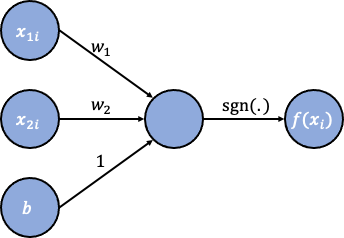

The example used for in this short algorithm was retreived from [Brilliant.org](https://brilliant.org), course Artificial Neural Networks, quiz Perceptron Learning Algorithms (not open source).

# Goal of the algorithm
Important parameters in a neural network (NN) model are the weights and biases. These parameters are initially set at random values and the network adjusts these values over and over until the prediction error is minimized. By training a very small data set on a very small neural network, I will illustrate this process.

# Introduction to perceptrons
In short, just like every statistical learning model, neural networks take in an input $\mathbf{x}$ and use a function $f$ to predict an output $y$. Here, we will focus on a NN with only one neuron, a perceptron. The perceptron can be activated, in which case it predicts a 1 for the output variable, or not, in which case its prediction is -1. Its value can also be zero, but this prediction will always be incorrect, since for our current problem $y \in \{-1,1\}$. The activation is based on a vector of inputs $\mathbf{x}$, using the $\mathrm{sgn}$-function: $$f(\mathbf{x})=\left\{ \begin{array}{lll} 1 & \text{if} & \mathbf{w} \cdot \mathbf{x} + b > 0 \\ 0 & \text{if} & \mathbf{w} \cdot \mathbf{x} + b = 0 \\ -1 & \text{if} & \mathbf{w} \cdot \mathbf{x} + b < 0 \end{array} \right.$$ where $\mathbf{w}$ is a vector of weights with the same length as the vector of inputs $\mathbf{x}$. The dot product of these vectors is a weighted sum of the inputs: $\mathbf{w} \cdot \mathbf{x} = w_1x_1+ \dots + w_px_p$, where $p$ is the length of the vectors. The bias, $b$, is a scalar that makes the perceptron more likely or less likely to be activated by this weighted sum. See Figure 1 for a graphical representation. The weights and the bias are parameters of the model that need to be such that the model predicts the outcome variable as well as possible. (To compare with the lineair regression context, the weights are the regression coefficients and the bias is the intercept.)



To come up with the optimal values for the weights and bias, we will use a mistake-driven algorithm. That is, the weights and bias will be updated if the prediction is not equal to the actual outcome value, i.e. $f(\mathbf{x}_i)\ne y_i$, for a certain sample $i$, where $i \in \{1,2,\dots,n\}$, and $n$ is the number of samples^[here, a sample refers to one data point: $(x_1, x_2, \dots, x_n, y)$]. The old weight vector $\mathbf{w}_k$ is updated to the new weight vector $\mathbf{w}_{k+1}$ with this rule: $$\mathbf{w}_{k+1}=\mathbf{w}_k + y_i\mathbf{x}_i.$$ The old bias term $b_k$ is updated to the new bias term $b_{k+1}$ with this rule: $$b_{k+1}=b_k + y_i.$$ We will loop over the samples, updating the parameter values, and stop if all $y_i$ are predicted correctly (so we assume we deal with a problem where the data points are completely linearly separable).

# Data points
We have $n=6$ samples and $p=2$ input variables. The input values $\begin{pmatrix}x_1\\x_2\end{pmatrix}$ are 
$\begin{pmatrix}-1\\1\end{pmatrix},$ 
$\begin{pmatrix}0\\-1\end{pmatrix},$
$\begin{pmatrix}10\\1\end{pmatrix},$
$\begin{pmatrix}0\\2\end{pmatrix},$ and
$\begin{pmatrix}1\\-3\end{pmatrix}.$
The corresponding $y$-values are $1, -1, -1, -1, 1, 1$ and $1$. Note that these data are entirely made up for the current purpose of illustrating a perceptron model.

We will enter the input values in a $n \times p$ `matrix`-object and the $y$-values in a `numeric`-object. 

```{r}
x <- matrix(c(-1,1,
              0,-1,
              3,1,
              0,2,
              1,-3), 
            byrow=TRUE, ncol=2)
y <- c(1,-1,1,1,-1)

n <- nrow(x); p <- ncol(x)
```

To visualize our data points we create a plot on a plane with a $x_1$-axis and a $x_2$-axis, colouring the points with $y=1$ red and the points with $y=-1$ blue. 

```{r}
plot(x[,1], x[,2],
     main="Data points",
     xlab="x1", ylab="x2", col=ifelse(y==1,"red","blue"),
     xlim=c(-3,4), ylim=c(-4,4)
     )
abline(h=0,v=0,col="grey")
```


# Initial weights and bias
The model parameters are randomly initialized. Therefore, we will set a random seed first. Here, we will do this by sampling weights from a uniform distribution between -4 and 4, i.e., $w_1,w_2 \sim \mathcal{U}(-4,4)$ and randomly selecting a value from $\{-1, 0, 1\}$ for the bias.

```{r}
set.seed(exp(1)) #set seed at e = 2.718282...
w <- runif(n=p, min=-4, max=4)
b <- sample(x=c(-1,0,1), size=1)
```

# Set ups
Some set ups that the algorithm will need.
```{r}
c <- rep(0, times=n) #a vector to keep track of the classification errors (0=error,1=correct)

#function to loop over the samples
loop <- function(i,n) return(ifelse(i<n, i+1, 1))
i <- 1 #start at first sample
```

# The algorithm
```{r}
while (sum(c) < n){           #while not all predictions are correct
  fx <- sign(w %*% x[i,] + b) #predicted value f(x) for current sample
  if (fx == y[i]){            #if prediction is correct...
    c[i] <- 1                 #store 'correct'
  } else {                    #if prediction is an error...
    c[i] <- 0                 #store 'error'
    w <- w + y[i]*x[i,]       #update weights
    b <- b + y[i]             #update bias
  }
  i <- loop(i,n)              #update sample index
}
```

# Results
Let's see what the parameter values are after convergence of the algorithm. 
```{r}
w
b
```

Now we want to see how these weights and biases separate the data points. The line that divides the data points can, as we saw earlier be expressed with the equation $\mathbf{w} \cdot \mathbf{x} + b = 0$, which can be rewritten as $$w_1x_1 + w_2x_2 = -b.$$ If a point is above this line, it is classified as a 1, if it is below this line, it its classified as a -1. Plugging in the parameter values, we can see that the line that the model ended up with is $$x_2=\frac{-b-w_1x_1}{w_2}=\frac{-1-0.479x_1}{2.619}.$$

```{r}
plot(x[,1], x[,2],
     main="Separating data points with a perceptron model",
     xlab="x1", ylab="x2", col=ifelse(y==1,"red","blue"),
     xlim=c(-3,4), ylim=c(-4,4)
     )
abline(h=0,v=0,col="grey")
abline(a=-1/2.619, -.479/2.619)
```


