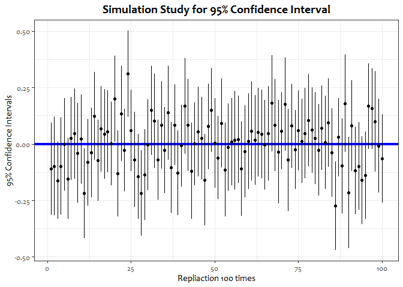

## Preparation


```r
# Load the required packages
library(ggplot2)
library(extrafont)
```

```
## Registering fonts with R
```

```r
library(tidyverse)
```

```
## -- Attaching packages ----------------------------- tidyverse 1.3.0 --
```

```
## √ tibble  3.0.1     √ dplyr   0.8.5
## √ tidyr   1.1.0     √ stringr 1.4.0
## √ readr   1.3.1     √ forcats 0.5.0
## √ purrr   0.3.3
```

```
## -- Conflicts -------------------------------- tidyverse_conflicts() --
## x dplyr::filter() masks stats::filter()
## x dplyr::lag()    masks stats::lag()
```

## 1. Sample 100 samples from a standard normal distribution.


```r
# Set a seed value for reproducibility
set.seed(322)

# Sample 100 samples from a standard normal distribution
samples <- rnorm(100)
print(samples)
```

```
##   [1] -0.09544847 -1.03431685 -2.10585237  1.27513290 -1.10689799 -0.21457206
##   [7] -0.33835926  1.39686081 -1.59622916 -0.85125435  0.48381328  0.95539360
##  [13] -0.72183391  2.17124982  0.34255607 -0.03282738  0.56816227 -0.85347712
##  [19]  1.54666943  0.09528655 -0.18597897 -0.65839102  0.11742111  0.57712987
##  [25]  0.30627469  0.96398210  1.64252911 -1.45229605  0.11283387  0.34477700
##  [31] -0.63817231  0.05073285 -1.68691223  1.69575657  0.20754504  0.33977183
##  [37] -0.78624745  0.20572899 -2.31682693  0.29967996  2.59057659 -0.68193691
##  [43]  1.07801222 -0.22757485  1.08570495 -0.35625676  0.01958816 -2.05188537
##  [49]  1.33834951  0.59170917 -1.49987588 -0.07601250 -0.46674339 -0.24034493
##  [55] -0.87062750 -0.37525329 -1.09747710 -1.97269909  0.73198670 -2.02644914
##  [61]  0.10618179  0.37755438 -1.20317654 -1.03416191 -0.56634713 -0.54908174
##  [67] -0.67489529 -0.53516656 -1.55631130 -0.04004800 -0.83875548 -1.15390602
##  [73]  0.71743596 -0.99969512 -0.41691291  1.59364375  0.99192986  0.66426875
##  [79]  0.93906100  0.25215073 -1.14325806 -0.29186165  1.43147009  0.61596744
##  [85]  0.23067064 -0.40171121  0.02687935  0.42419830 -2.46951353  1.42343424
##  [91] -0.28414773  1.49213670 -1.11473568  0.28867321 -0.20248948 -0.03242496
##  [97] -1.23320615 -1.41478531  1.30065520 -0.15398483
```

## 2. For each of these samples, calculate the following statistics for the mean:

### (1) absolute bias


```r
# Calculate the absolute bias
ab.samples <- abs(mean(samples) - 0)
print(ab.samples)
```

```
## [1] 0.1091808
```

### (2) standard error


```r
# Make a function that returns a standard error
se.ihnwhi <- function(x) {
  x <- na.omit(x)
  n.x <- length(x)
  sd.x <- sd(x)
  se.x <- sd.x/sqrt(n.x)
  return(se.x)
}

se.samples <- se.ihnwhi(samples)
print(se.samples)
```

```
## [1] 0.1040862
```

### (3) lower bound of the 95% confidence interval


```r
lb.samples <- mean(samples) - qnorm(.975)*se.samples
print(lb.samples)
```

```
## [1] -0.3131859
```

### (4) upper bound of the 95% confidence interval


```r
ub.samples <- mean(samples) + qnorm(.975)*se.samples
print(ub.samples)
```

```
## [1] 0.09482433
```

## 3. Create a plot that demonstrates the following:

> “A replication of the procedure that generates a 95% confidence interval that is centered around the sample mean would cover the population value at least 95 out of 100 times” (Neyman, 1934).


```r
# Set a seed value for replicability
set.seed(322)

# Make a function that creates a confidence interval
ci.ihnwhi <- function(x){
  x <- na.omit(x)
  mean.x <- mean(x)
  n.x <- length(x)
  sd.x <- sd(x)
  se.x <- sd.x/sqrt(n.x)  
  lb.x <- mean.x - qnorm(.975)*se.x
  ub.x <- mean.x + qnorm(.975)*se.x
  info <- c(lb.x, mean.x, ub.x)
  return(info)
}

# Replicate drawing 100 random values 100 times
sim.ci <- replicate(100, rnorm(100), simplify = FALSE)

# Create an empty matrix to store the values
matrix.ci <- matrix(NA, nrow=100, ncol=3)

# Create 100 confidence intervals for replicated datasets
for (i in 1:100) {
  matrix.ci[i,] <- ci.ihnwhi(sim.ci[[i]])
}

# Designate column names for the confidence interval matrix
colnames(matrix.ci) <- c("lower", "mean", "upper")

# Treat matrix.ci as a data frame
matrix.ci <- data.frame(matrix.ci)

ggplot(matrix.ci, aes(x = 1:100, y = min(matrix.ci):max(matrix.ci))) + 
  theme_bw() +
  geom_hline(aes(yintercept=0), color = "blue", size = 1.5) +
  geom_pointrange(aes(ymax = upper, y = mean, ymin = lower), shape=20) +
  xlab("Repliaction 100 times") +
  ylab("95% Confidence Intervals") +
  ggtitle("Simulation Study for 95% Confidence Interval") +
  theme(text=element_text(family="Candara"),
        plot.title = element_text(size = 15, color="black", hjust=0.5, face="bold"))
```

<!-- -->

## 4. Present a table containing all simulated samples for which the resulting confidence interval does not contain the population value.


```r
# Filter rows that does not contain the population values
matrix.ci.condition <- filter(matrix.ci, lower > 0 | upper < 0)

# Print the table that meets the condition
print(matrix.ci.condition)
```

```
##          lower       mean       upper
## 1 -0.416592917 -0.2182035 -0.01981406
## 2  0.009705351  0.1997262  0.38974698
## 3  0.121451633  0.3111996  0.50094765
## 4 -0.405932293 -0.2167788 -0.02762539
## 5 -0.468709613 -0.2734236 -0.07813764
```
