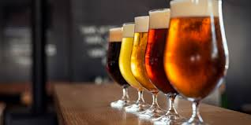
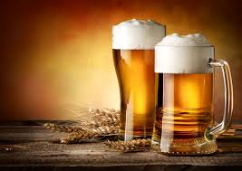

```{r,include=FALSE}
library(DT)
library(tidyverse)
library(plotly)
library(sjPlot)
library(sjmisc)
library(sjlabelled)
knitr::opts_chunk$set(message = FALSE,warning=FALSE,echo=FALSE)
```
# Why am i (pseudo)researching this?

## There are a few reasons
+ I like drinking beer 
+ I was in the mood to draw some random values from a normal distribution
+ I read that *consumption of low-alcohol and non-alcoholic beers can avoid
possible health threatening issues related to excessive alcohol intake*[@sohrabvandi2012health].

# Some plots to illustrate possible relationships


```{r,include=FALSE,cache=TRUE}
# data creation
set.seed(100)
type<-sample(c("White","Blond","Triple","Pilsener","Quad"),20,replace=TRUE)
feelings<-rnorm(20,7,1)
hangover<-rnorm(20,5,2)
data<-data.frame(type,feelings,hangover)
```


## First:g the relationship between my feelings and hangovers


```{r,fig.align="center"}
ggplot(data,aes(x=feelings,y=hangover))+
  geom_point()+
  geom_smooth(method="lm",se=FALSE)+
  theme_minimal()

```


## Now my Hangover per type of beer 
```{r}

plot <- ggplot(data, aes(hangover, fill = type)) + 
  geom_density(alpha = 0.5, position = "stack") + 
  ggtitle("Hangover per beer-type")+
  theme_minimal()

ggplotly(plot)
```


# We check these findings through using a regression analysis

## A linear regression analysis
```{r,fig.align="center",fig.width=3,fig.height=2}
model<-lm(hangover~feelings+type,data=data)
tab_model(model)
  
```
Note. "Blond" beer is used as reference here


## These are the resulting equations for each of the different types of beer
$$
\begin{aligned}
  Hangover_i &= 4.32 + Feelings_i*0.18 (Blond) \\
              Hangover_i &= 4.32 + Feelings_i*0.18 - 0.49(Pilsener)\\
Hangover_i &= 4.32 + Feelings_i*0.18 + 2.01(Quad)\\
                             Hangover_i &= 4.32 + Feelings_i*0.18 -1.55(Triple)\\
 Hangover_i &= 4.32 + Feelings_i*0.18-0.45(White)
\end{aligned}
$$


# Next we show the data on which the plot and analyses are based

## The dataframe, as presented through a datatable
```{r}
datatable(data,options = list(pageLength = 5))
```

## The data was created through the following r-code
```{r,eval=FALSE,echo=TRUE}
# data creation
set.seed(100)
type<-sample(c("White","Blond","Triple",
               "Pilsener","Quad"),20,replace=TRUE)
feelings<-rnorm(20,7,1)
bottle<-sample(c("regular","large","small"),20,replace=TRUE)
hangover<-rnorm(20,5,2)
data<-data.frame(type,feelings,bottle,hangover)
```

# Now for a two-collumn page, to flex our programming skills

## Some conclusions 
<div style="float: left; width: 40%;">
+ Beer is nice
+ My feelings and the type of beer i drink are not related to my hangovers
+ This study might show some methodological shortcomings
+ I hope you can enjoy a nice (cold) beer after reading this
</div>

<div style="float: right; width: 60%;">


</div>

# That's all folks
## References
