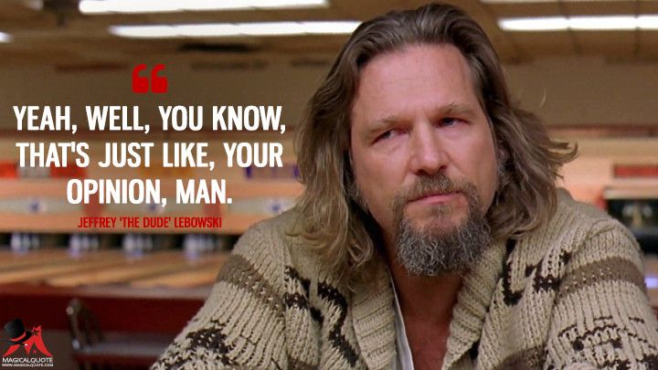

```{r, echo=FALSE}
setwd("C:/Users/pauli/Desktop/Lebowski presentation")
```


## Movie night planning

Let's plan a movie night. This has to be carefully executed in several steps.

```{r, echo = F}

library(DT)
prep <- matrix(NA, nrow = 3, ncol = 2)
colnames(prep) <- c("Preparation", "Food")
prep[,1] <- c("Take the night off", "Invite friends over", "tidy up your living room")
prep[,2] <- c("Drinks", "chips (salt flavor)", "your favorite chocolate")
prep%>% datatable(options = list(pageLength = 3))
```

## Some very carefully selected scenes 


<iframe width="1280" height="720" src="https://www.youtube.com/watch?v=V0aDEvmf5u0" frameborder="0" allow="accelerometer; autoplay; encrypted-media; gyroscope; picture-in-picture" allowfullscreen></iframe>


## Let's not 


Let $x$ be the money you owe some guy you don't really know. Your debt increases by $x$ every year. What do you owe this guy after w years?


$$\begin{align*}
y &\sim Trouble(500, 100) \\
y &=  x * w
\end{align*}$$


## 'This is not an academic topic'


```{r, out.width = "50%", fig.align = 'center', echo=F}
library(knitr)

```


## In conclusion

```{r eval=FALSE, include=TRUE, cache=T}
to_round_this_off <-
  function(x) 
    print("Let's sum this up.")
```


**" Is this your homework, Larry?"** [@elduderino]

Yes, it is.

## References
<div id="refs"></div>
