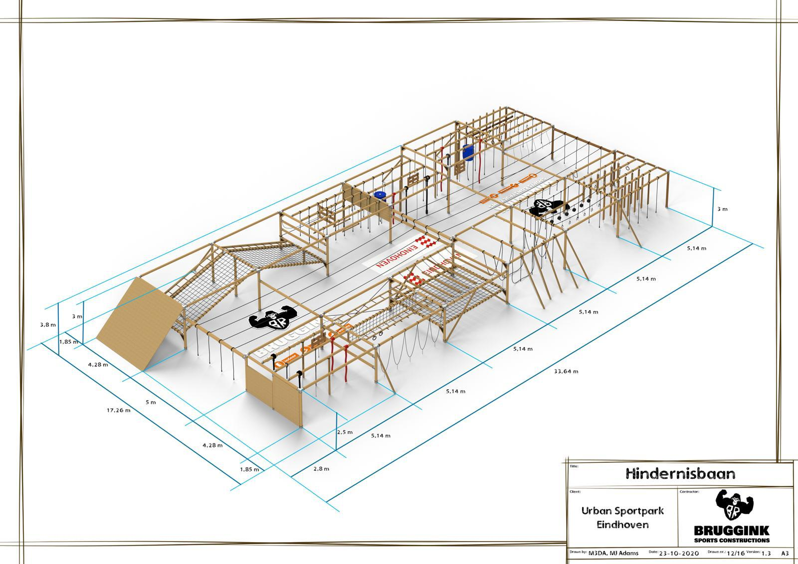

## The course
Unfortunately the course is still under construction as we speak.
However, this is what the course is going to look like! 
```{r, out.width = "50%", fig.align = 'center', echo=F}
library(knitr)

```


## A training schedule
A regular training schedule looks like this:

```{r, echo = F}
library(DT)
schedule <- matrix(NA, nrow = 7, ncol = 4)
colnames(schedule) <- c(LETTERS[1:3], "Extra")
schedule[,1] <- c("2 x Swing over", rep(" ", 6))
schedule[,2] <- c("Knotsenplank enteren L & R om", "2x twee touw Swing over", "korte touwtjes + monkeybars", "Knotsenplank knotsen h & t", "Traverseren", "Hufter + ringen", "Apenhang h & t")
schedule[,3] <- c("10 x tikkie takkie", "10 x 10 sec muurzit", "10 squatjump", "10 x crocodile pushup", "10 x toes to bar", "10 x pull up", "")
schedule[, 4] <- c("lange apenhang", "rondje constructie", rep("", 5))

schedule %>% datatable(options = list(pageLength = 7))
```

## An example video

<iframe width="560" height="315" src="https://www.youtube.com/embed/8op2rwOqHmc" frameborder="0" allow="accelerometer; autoplay; clipboard-write; encrypted-media; gyroscope; picture-in-picture" allowfullscreen></iframe>
s

## An aligned multi-row equation

Let $x$ denote days executing the training schedule per month and let $z$ represent basic physical condition. 
Eventual physical condition is expressed in $y$ ranging from to 100. 

Let's assume that $z$ comes from a normal distribution with $\mu = 20$ and $\sigma^2 = 5$, and $y$ can be expressed as a function of both $z$ and $x$ such that
$$
\begin{align*}
z &\sim  \mathcal{N}(\mu, \sigma^2)\\
y &= z + 0.5x 
\end{align*}
$$

## A citation & displayed R code chunk

```{r eval=FALSE, include=TRUE, cache=T}
Get.motivated <-
  function(x) 
    print("The way to get started is to quit talking and begin doing"
)

```

To get me motivated to work out, even in this cold weather, I could quote Walt Disney to myself:

**"The way to get started is to quit talking and begin doing".**
Unfortunately, I could not find the actual source for this quote other then on tacky websites [@philosiblog_2020].
Therefore, here I think it is better to also use a nice quote which I do have the actual source 
for **"All models are wrong but some are useful"** [@BOX1979201]

## References
<div id="refs"></div>


