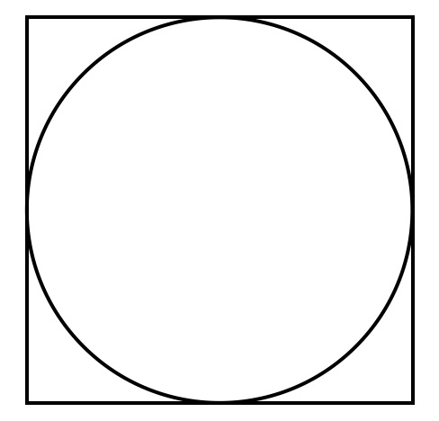

## Intro: the approximation of Pi

The aim of this simulation is to approximate Pi using a Monte Carlo simulation. The idea behind this comes from the fact that if we randomly generate points in a square, $\pi/4$ of them should lie in a circle surrounded by the square. Let's make this more clear: 

**Step 1:** We have a circle with radius 0.5; and a 1x1 square where this circle is incribed:

{width=200px}

**Step 2:** We know that the area of a circle is equal to $\pi r^2$. Using the example above, we can simplify this to $\pi * 0.5^2 = \pi * 0.25 = \pi/4$. The area of the corresponding square is equal to $4r^2$, which in the given example equals $4*0.5^2 = 1$. Hence, we know that the circle covers an area of $(\pi/4) / 1 = \pi/4$ of the square.

**Step 3:** Next, if we generate random points (i.e. coordinates x and y) from a uniform distribution, they can fall anywhere within the square. From the above calculation, we know the proportion of points that fall within the circle (namely $\pi/4$), which can be calculated by the number of points falling within the circle, divided by the total number of points ($N_{inner} / N_{total}$). Hence, we know that: $$\pi/4 \approx \frac{N_{inner}}{N_{total}} $$ $$\pi \approx 4*\frac{N_{inner}}{N_{total}}$$

## Set up 

First, we will load the required packages: 
```{r warning=FALSE, message=FALSE}
library(tidyverse)
library(ggplot2)
library(knitr)
library(kableExtra)
```

Second, we will fix the random seed to ensure that the results are replicable, even though we use a random number generator.
```{r}
set.seed(2)
```

## Simulation 

**Parameters:** The parameters that need to be specified beforehand are the number of simulations and the radius of the circle.

```{r}
nsim <- 10000
r <- 0.5
```

**Function:** Function to randomly generate a point and check whether it falls within the circle.
```{r}
point <- function(radius=1){
  # sample x and y from uniform distribution with lower and upper limit equal to -r and r  
  x <- runif(1, -radius, radius)
  y <- runif(1, -radius, radius)
  return(list(x=x, 
              y=y,
              in_circle=x^2 + y^2 <= radius^2))
}
```

**Monte Carlo simulations:** We randomly generate points within the square and check whether they fall within the circle using the previously created function. For each simulation, we store the coordinates of the point (i.e. x and y) and whether the point falls within the circle (TRUE/FALSE) in a dataframe. 

```{r}
df <- data.frame(x=rep(NA,nsim), y=rep(NA,nsim), in_circle=rep(NA,nsim))

for (i in 1:nsim){
  sim <- point(radius = r) # simulate point and check whether it's in the circle
  # save results of simulation in a data frame
  df$in_circle[i] <- sim$in_circle
  df$x[i] <- sim$x
  df$y[i] <- sim$y
}

df %>% 
  head() %>% 
  kable(.,"html") %>%
  kable_styling(bootstrap_options = c("striped", "hover", "condensed"),
                full_width = F)
```


## Results
**Approximating Pi: ** Using the above described formula, we can now easily calculate pi: 
```{r}
# estimate pi
pi_approx <- 4 * sum(df$in_circle) / nsim
```

**Using this Monte Carlo simulation, pi has been approximated to `r pi_approx`.**

**Visualisation:** Lastly, we will visualise the randomly drawn points. Points falling within the circle are coloured blue; points falling outside the circle are coloured red.

```{r fig.width=5, fig.height=5}
df %>% 
  mutate(in_circle = factor(in_circle)) %>%
  ggplot(aes(x=x, y=y, color=in_circle)) + 
  geom_point(size=0.6) + 
  theme_minimal() + 
  theme(legend.position='none') 
```

## Session Info

```{r}
sessionInfo()
```

