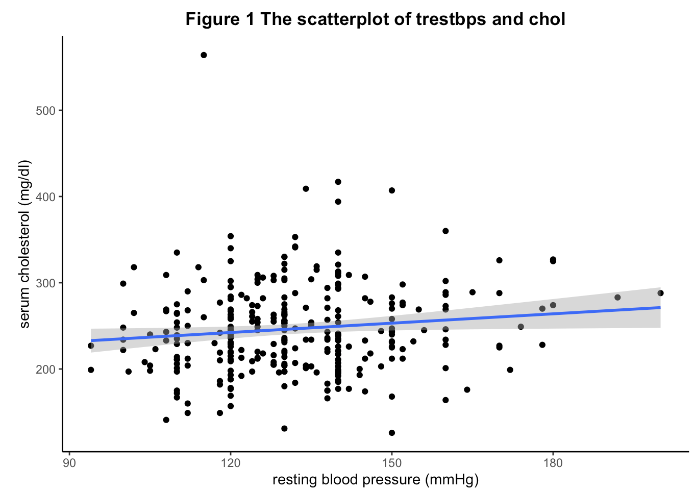

```{r setup, include=FALSE}
library(knitr)
library(DT)
library(dygraphs)
heart <- read.csv("heart.csv")
heart <- heart[,1:12]
```


## Mechaninsm of Hypercholesterolemia

```{r, out.width="50%", fig.align='center', echo=FALSE}
fig <- "https://d2ebzu6go672f3.cloudfront.net/media/content/images/cr/205091.jpg"
include_graphics(fig)
```

## Interactive table of a heart disease dataset

Here we present a  dataset with patients suffering from Hypercholesterolemia
```{r, out.height= "30%", echo=FALSE}
heart %>% 
  datatable(options = list(pageLength  = 8))
```

## Plots
```{r, eval=TRUE}
fig1 <- ggplot(heart, aes(x = trestbps, y = chol)) +
  geom_point() +
  geom_smooth(method = "lm") + 
  theme_bw() + 
  theme(panel.border = element_blank(), panel.grid.major = element_blank(),
        panel.grid.minor = element_blank(), axis.line = element_line(colour = "black")) +
  labs(x = "resting blood pressure (mmHg)", y = "serum cholesterol (mg/dl)") + 
  ggtitle("Figure 1 The scatterplot of trestbps and chol") +
  theme(plot.title = element_text(hjust = 0.5, face = "bold"))

fig1
```


## How can cholesterol accumulate  in the  vessel
<center>
<div  style="width:800px">
<iframe width="917" height="300" src="https://www.youtube.com/embed/LMJbrU4FxjY" frameborder="0" allow="accelerometer; autoplay; clipboard-write; encrypted-media; gyroscope; picture-in-picture" allowfullscreen></iframe>
</div>
</center>

## Relation between high serum cholesterol and blood pressure
<table>
<tr>
<td>

</td>
<td>
  <ul>
  <li>
  The systolic blood pressure ranges from 94 to 200 mmHg. More than half of the subjects have normal blood pressure.
  </li>
  <li>
  The serum cholesterol ranges from 100  to 564 mg/dl 
  </li>
  <li>
  With the increase of blood pressure, the serum cholesterol grows up a bit as well
  </li>
  </ul>
  </td>
  </tr>
  </table>

## The distributions of the variables and regression formula

The linear regression formula is as follows:
$$
chol = 121.42 + 0.04\times trestbps + \epsilon
$$
$$
\epsilon \sim N(0, 304.91)
$$

## Citation
High serum cholesterol and high blood pressure are closely related [@Ivanovic2015a]. There are many prediction models that summarize the prognostic factors [@PerezDeIsla2017].


