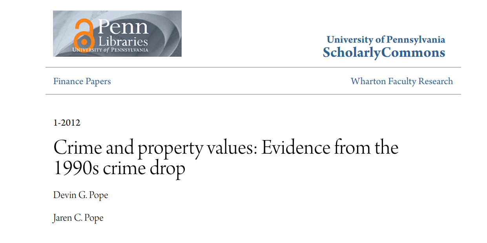

```{r include = FALSE}
require(MASS)
require(ggplot2)
require(DT)
require(plotly)
```

## Boston dataset

We will focus on the relation between housing value and crime rate per town in Boston. A first glance at the data that will be used: 

```{r, echo=FALSE}
#fig.width=1, out.width="50%", 
Boston_chunk <- Boston %>% select(medv, crim)
datatable(Boston_chunk, options = list(pageLength = 5))
```

## Relation between housing value and crime rate
```{r fig.align = 'center', echo=FALSE}
Boston %>% 
  ggplot(aes(x = crim, y = medv)) +
  geom_point() +
  labs(x = "per capita crime rate by town", y = "median value of owner-occupied homes", title = "housing value vs crime rate in Boston")+
  theme_minimal()
```

## Modeling the relation
```{r echo=FALSE}
mod <- lm(log(medv) ~ log(crim), data = Boston)
pred <- predict(mod)
#coef(mod)

pl <- Boston %>% 
  ggplot(aes(x = log(crim), y = log(medv))) +
  geom_point() +
  geom_line(aes(y = pred)) + 
  theme_minimal()+
  labs(y = 'log median value of owner-occupied homes', x = 'log per capita crime rate by town') 

ggplotly(pl)
```

Based on the plot we may expect a linear relation between the log of the housing values and the log of the crime rate with a negative rate.

## The defined model
```{r eval=FALSE}
mod <- lm(log(medv) ~ log(crim), data = Boston)
```

## Formula
The corresponding formula's:
$$
\begin{align}
\hat{y}& = \frac{A}{x^\theta},\\
\log(\hat{y})& = \log{A}-\theta\log(x)\\
\end{align}
$$

## Conclusions from this data and literature
<div class='columns-2'>
- Relation between crime rate by town and housing value is negative (possibly based on a logarithmic relationship).
- Suggests inreasing crime rates are associated with decreasing housing values.
- This is in accordance with existing literature [@pope2012].

<center>

</center>

</div>

## References

<div id="refs"></div>